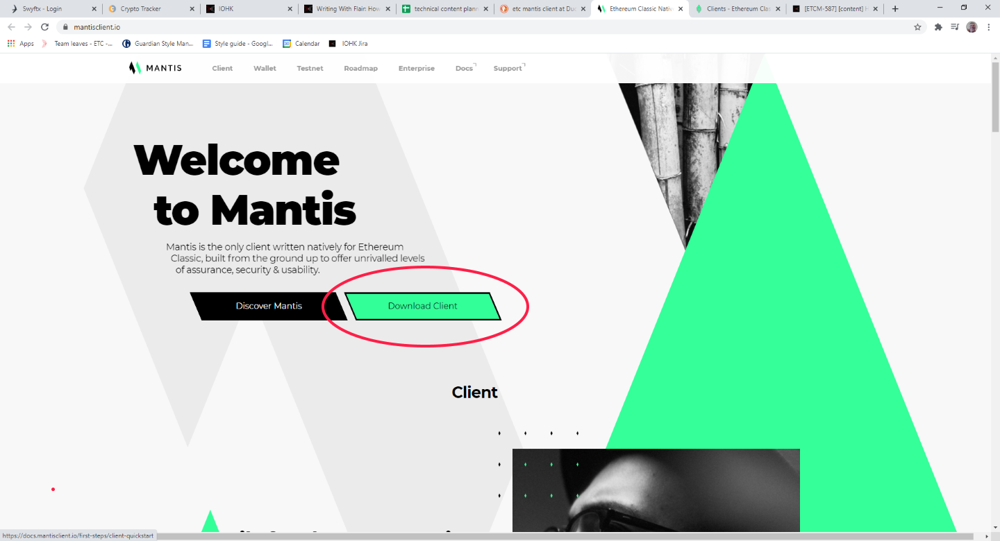

> Author's note to reviewers: Please check the unix installation steps. I do not have a unix machine. Linux or unix?

There are two Mantis applications you can use: the Mantis client and the Mantis wallet. You can download either or both.

This section describes how to install the Mantis client on your Linux machine. For instructions to install the Mantis wallet, you can go [here](/install/-install-wallet-Unix).


## Prerequisites

These are the prerequisites for installing Mantis client:
* A Java Virtual Machine (JVM) with version 1.8.x.
    To check the JVM version, use `java -version`.
    To install Java, follow [these instructions](https://java.com/en/download/help/download_options.html).
    (Note that  the Mantis team has not tested the wallet with JVM 1.9 or later versions)
* 4G of memory (RAM)
    Additional RAM is needed for the DAG file _if mining_ is enabled.
* 250GB of disk space to ensure fast sync of the node. You will need more than that for the future growth of the chain. An SSD of at least 500G is recommended for full sync.


## Installing Mantis client

To install Mantis, follow these steps:
1. Download the Linux client binary zip archive from  the [Mantis Client page](https://mantisclient.io/):


2. Note the checksum.
> Remember to run checksum verification on your downloads. Refer to [this section](/first-steps/downloads#checksum) for instructions.

3. Move the zip file to your preferred folder and unzip the client archive file. Finally, remove the zip file.

```
mv mantis-3.1.0.zip /home/<user>/bin/
cd /home/<user>/bin/
unzip mantis-3.1.0.zip
rm mantis-3.1.0.zip
```

4. (Optional) Rename your mantis bin folder for ease of future updates.

```
mv /home/<user>/bin/mantis-3.1.0 /home/<user>/bin/mantis
```

> Default folders for applications on Linux are `/home/<user>/Applications` and `/home/<user>/bin`, or `/usr/local/bin`. We recommend placing the mantis folder in there.


5. Now, you can run the client from its install folder.

```
./bin/mantis
```

This command runs the client in the foreground with settings as defined in the `conf` folder files.


## PATH
6. (Optional, but recommended) Add the binary to your PATH. Add the following line to your `.profile`/`.bashrc`/`.zshrc` (or equivalent). Source the profile file.

```
export PATH=$PATH:~/bin/mantis-3.1.0/bin
source ~/.profile
```

Now you can execute the client from any folder by running `mantis`.


## Updating the Mantis client

To update the Mantis client, replace the Mantis folder with the newer version.

```
mv mantis-<newer-version>.zip /home/<user>/bin/
unzip mantis-<newer-version>.zip /home/<user>/bin/mantis
```
