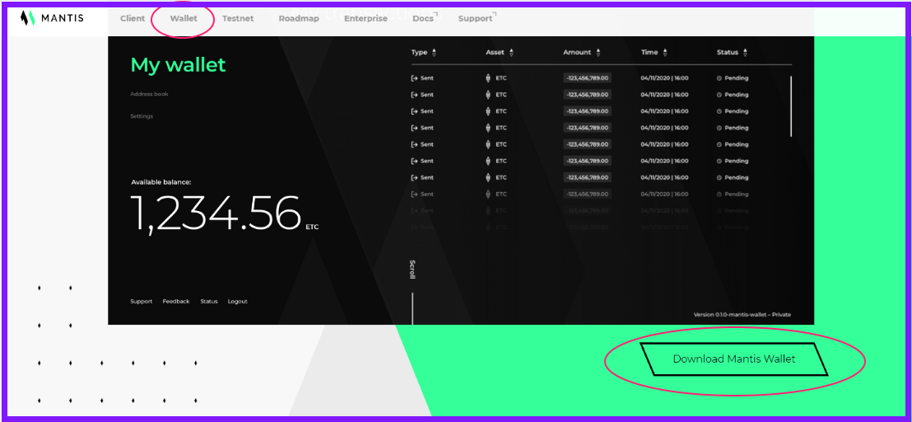

This section outlines how to install the Mantis wallet on your Windows machine.

Follow these instructions to install the Mantis wallet or go [here for instructions to install the Mantis client](/install/install-client).

## Requirements

These are the prerequisites you need for installing Mantis Wallet:
* A Java Virtual Machine (JVM) with version 1.8.x.
    To check the JVM version, use `java -version`.
    To install Java, follow [these instructions](https://java.com/en/download/help/download_options.html).
    (Note that the Mantis team has not tested the client with JVM 1.9)
* 4G of memory (RAM)
    Additional RAM is needed for the DAG file _if mining_ is enabled.
* 250GB of disk space to ensure fast sync of the node. You will need more space than that for the future growth of the chain. An SSD of at least 500G is recommended for full sync.

## Install

To install Mantis Wallet, follow these steps:

1. Download the client binary from the Mantis Wallet page:
.

2. Choose and download the correct installer from the Assets drop-down:

Choose the Windows 64 bit installer, and note the checksum.

> Remember to run checksum verification on your downloads. Refer to [this section](first-steps/downloads#checksum) for instructions.

3. Execute the binary file to run the installer. It is a standard Windows installer.

> The default installation folder is Program Files/Mantis. We recommend placing the Mantis files there.

4. Now, you can run the Wallet by double-clicking its executable or running it through your desktop environment. The installation process will have added a shortcut to your start menu.

As soon as it starts, the Mantis wallet will start synchronizing with the environment you have started it in. In the image, it is started in the Sagano Testnet.

For the next steps in the story, go to the **Learn** or **How to** sections.

## Update

To update the Mantis wallet, download a new installer and repeat the installation process.
