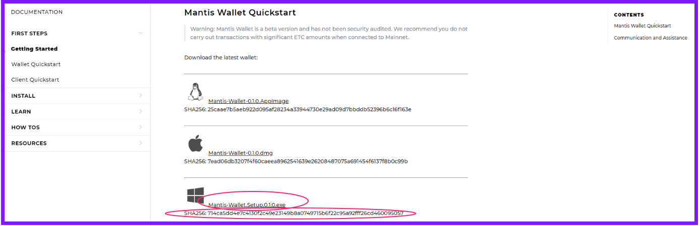
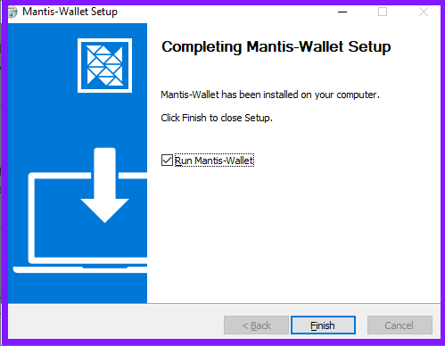

Before you start, the team recommends that you read [Getting Started](/first-steps/getting-started) if you haven't already. It's a 30-second read that will save you time.

Mantis is both a graphical wallet and a command-line client. You can download either or both.

This section outlines how to install the Mantis wallet on your Windows machine. If you want the client, follow the [client installation instructions](/install/-install-client-windows).

## Prerequisites

These are the prerequisites for installing Mantis wallet:
* A Java Virtual Machine (JVM) with version 1.8.x.
    To check the JVM version, use  
     `java -version`.  
    To install Java, follow [these instructions](https://java.com/en/download/help/download_options.html).
    (Note that the Mantis team has not tested the wallet with JVM 1.9 or later versions)
* A minimum of 4GB of memory (RAM)
    * 250GB of disk space to ensure fast sync of the node. You will need more than that for the future growth of the chain. You should have an SSD of at least 500GB for full sync.

## Installing the wallet

To install Mantis wallet, follow these steps:

1. Choose and download the Windows 64 bit installer from the [wallet quick-start page](/first-steps/wallet-quickstart):

2. Note the checksum.
> Remember to run checksum verification on your downloads. Refer to [this section](/how-tos/how-check-hash-windows) for instructions.

3. Execute the binary file to run the installer. It is a standard Windows installer.

> The default installation folder is Program Files/Mantis-Wallet. We recommend placing the Mantis files there.

4. Now, you can run the wallet by double-clicking its executable or running it through your desktop environment. The installation process adds a shortcut to your start menu.

During startup, Mantis wallet allows you to choose the network. The network is the blockchain to synchronize. Here is the splash screen:

For information on the available networks, see [this page](/learn/mantis-client-wallet)

As soon as it starts, Mantis begins synchronizing with the chosen network. In the image, Mantis is using the Sagano Testnet.

For the next steps in the story, go to the **Learn** or **How to** sections.

## Updating the wallet

To update the Mantis wallet, download a new installer and repeat the installation process.
