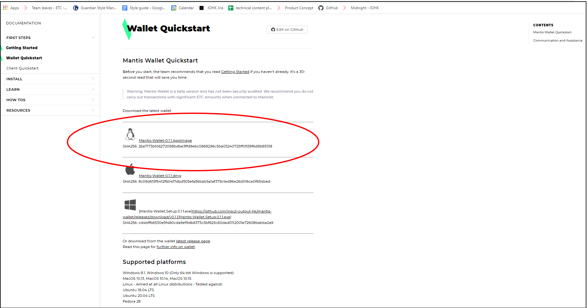

This section outlines how to install the Mantis wallet on your Linux machine.

Follow these instructions to install the Mantis wallet or go [here for instructions to install the Mantis client](/install/install-client).


## Requirements

These are the prerequisites for installing Mantis Wallet:
* A Java Virtual Machine (JVM) with version 1.8.x.
    To check the JVM version, use `java -version`.
    To install Java, follow [these instructions](https://java.com/en/download/help/download_options.html).
    (Note that  the Mantis team has not tested the client with JVM 1.9)
* 4G of memory (RAM)
    Additional RAM is needed for the DAG file _if mining_ is enabled.
* 250GB of disk space to ensure fast sync of the node. You will need more space than that for the future growth of the chain. An SSD of at least 500G is recommended for full sync.

## Install

To install Mantis Wallet, follow these steps:

1. Download the client binary from the Wallet page at [MantisClient.io](https://mantisclient.io/):
.
Choose and download the correct installer from the Wallet quick-start page:

Choose the Linux installer, and note the checksum.
```
Mantis-Wallet-<version>.AppImage
Mantis-Wallet-<version>.dmg
Mantis-Wallet.Setup.<version>.exe
```

> Remember to run checksum verification on your downloads. Refer to [this section](first-steps/downloads#checksum) for instructions.

2. Move the binary file to your preferred folder and unzip the client archive file. Finally, remove the zip file.

```
mv Mantis-Wallet-3.1.0.AppImage /home/<user>/bin/
cd /home/<user>/bin/
```

> Default folders for applications on Linux are `/home/<user>/Applications` and `/home/<user>/bin`, or `/usr/local/bin`. We recommend placing the Mantis folder in there.


3. Now, you can run the Wallet by double-clicking the file or running it through your Desktop environment.

As soon as it starts, the Mantis wallet begins synchronizing with the environment you have started it in. In the image, it is started in the Sagano Testnet.


For the next steps in the story, go to the **Learn** or **How to** sections.

## Update

To update the Mantis wallet, replace the binary with the newer version and use the new file instead of the older one.
```
mv Mantis-Wallet-<newer-version>.AppImage /home/<user>/bin/
```
