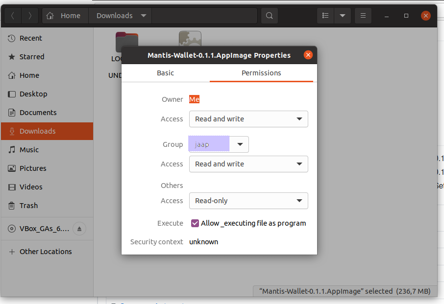
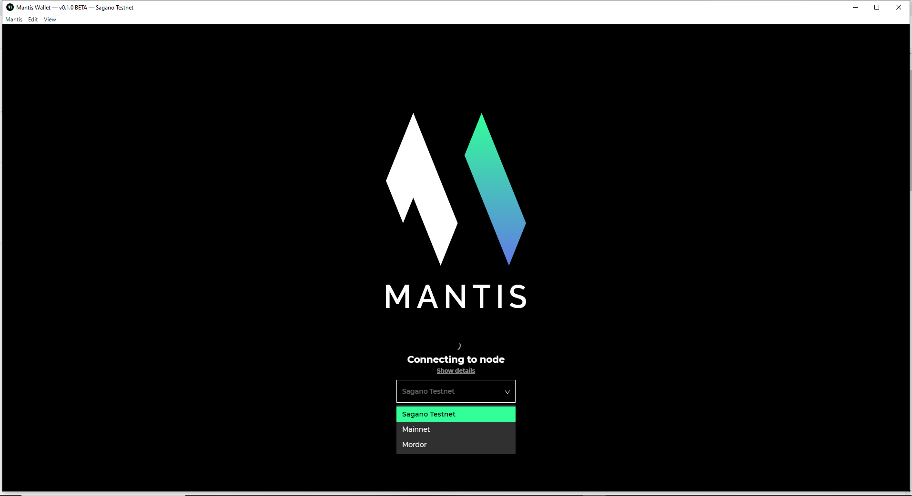
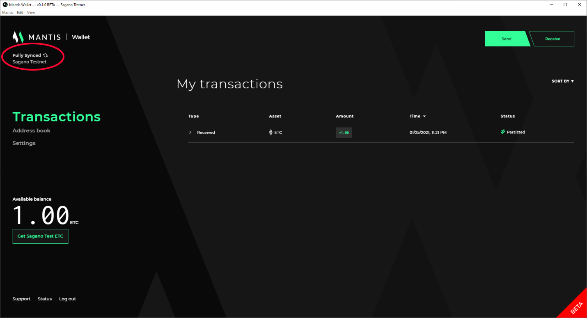

Before you start, the team recommends that you read [Getting Started](/first-steps/getting-started) if you haven't already. It's a 30-second read that will save you time.

Mantis is both a graphical wallet and a command-line client. You can download either or both.

Follow these instructions to install the Mantis wallet. If you want the client, follow the [client installation instructions](/install/install-client-linux-mac).


## Prerequisites

These are the prerequisites for installing Mantis wallet:
* A Java Virtual Machine (JVM) with version 1.8.x.
    To check the JVM version, use
     `java -version`.
    To install Java, follow [these instructions](https://java.com/en/download/help/download_options.html).
    (Note that  the Mantis team has not tested the wallet with JVM 1.9 or later versions)
* 4G of memory (RAM)
    Additional RAM is needed for the DAG file _if mining_ is enabled.
* 250GB of disk space to ensure fast sync of the node. You will need more than that for the future growth of the chain. You should have an SSD of at least 500GB for full sync.

## Installing the wallet

To install Mantis wallet, follow these steps:

1. Download the wallet binary from the [wallet releases page](https://github.com/input-output-hk/mantis-wallet/releases/latest).
Choose and download the Linux installer from the wallet releases page.

```
Mantis-Wallet-<version>.AppImage
```
2. Note the checksum.
> Remember to run checksum verification on your downloads. Refer to [this section](/how-tos/how-check-hash-linux) for instructions.

3. For more information, see [where to place the AppImage file](https://docs.appimage.org/user-guide/faq.html#question-where-do-i-store-my-appimages). The Linux installer is the one with the .AppImage extension.

4. Mark the Appimage file executable:

5. Now, you can run the wallet by double-clicking the AppImage file or running it through your Desktop environment.

During startup, Mantis wallet allows you to choose the network. The network is the blockchain to synchronize. Here is the splash screen:


For information on the available networks, see [this page](/learn/mantis-client-wallet)

As soon as it starts, Mantis begins synchronizing with the chosen network. In the image, Mantis is started in the Sagano Testnet.


For the next steps in the story, go to the **Learn** or **How to** sections.

## Updating the wallet

To update the Mantis wallet, replace the binary with the newer version and use the new file instead of the older one.
```
mv Mantis-Wallet-<newer-version>.AppImage /home/<user>/bin/
```
