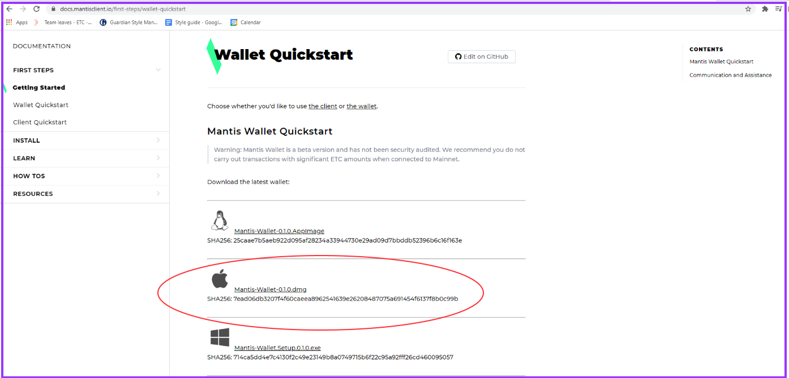
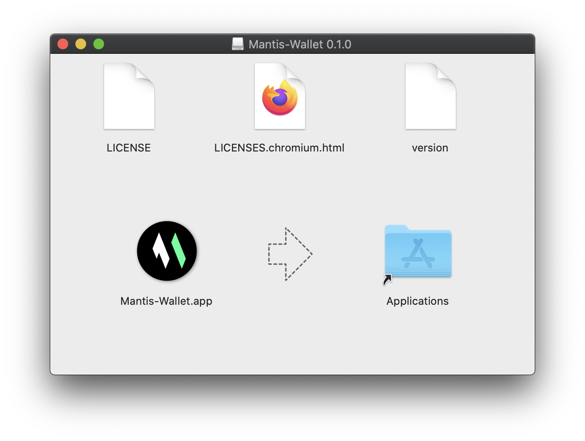

Before you start, the team recommends that you read [Getting Started](/first-steps/getting-started) if you haven't already. It's a 30-second read that will save you time.

Mantis is both a graphical wallet and a command-line client. You can download either or both.

This section outlines how to install the Mantis wallet on your Apple Mac machine. Instructions to install the Mantis client are [here](/install/install-client-mac).

## Prerequisites

These are the prerequisites for installing Mantis Wallet:
* A Java Virtual Machine (JVM) with version 1.8.x.
    To check the JVM version, use  
     `java -version`.  
    To install Java, follow [these instructions](https://java.com/en/download/help/download_options.html).
    (Note that  the Mantis team has not tested the wallet with JVM 1.9 or later versions)
* A minimum of 4GB of memory (RAM)
    Additional RAM is needed for the DAG file _if mining_ is enabled.
* 250GB of disk space to ensure fast sync of the node. You will need more than that for the future growth of the chain. You should have an SSD of at least 500GB for full sync.

##  Installing the wallet

To install Mantis wallet, follow these steps:

1. Choose and download the Apple Mac installer from the wallet quick-start page:

Note the checksum.
```
Mantis-Wallet-<version>.dmg
```
> Remember to run checksum verification on your downloads. Refer to [this section](/how-tos/how-check-hash-mac) for instructions.

4. Open (mount) the .dmg file and proceed with a standard Mac install. 

```
mv Mantis-Wallet-3.1.0.AppImage /home/<user>/bin/
cd /home/<user>/bin/
```
After mounting the dmg file, drag the 'Mantis-Wallet' icon to the 'Applications' shortcut in the same window. You can unmount it later.

>We recommend placing the Mantis folder in the default folders provided during install.

5. Now, you can run the wallet by double-clicking the file or running it through your Desktop environment.

During startup, Mantis wallet allows you to choose the network. The network is the blockchain to synchronize. Here is the splash screen:


For information on the available networks, see [this page](/learn/mantis-client-wallet)

As soon as it starts, Mantis begins synchronizing with the chosen network. In the image, Mantis is started in the Sagano Testnet.


For the next steps in the story, go to the **Learn** or **How to** sections.

## Update

To update the Mantis wallet, replace the binary with the newer version and use the new file instead of the older one.

```
mv Mantis-Wallet-<newer-version>.AppImage /home/<user>/bin/
```
