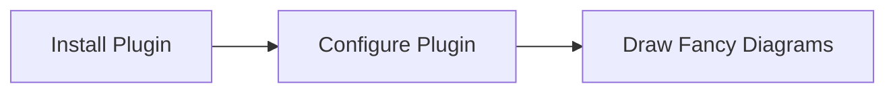

import Countdown from '../src/components/Countdown'
import Image from '../src/components/Image'

<Info info>

#### Information

These are reusable info components. Please note the format, spacing and indentation must be as you see here.

</Info>

<Info warn>

### Caution

Sunt proident minim ex deserunt tempor adipisicing non exercitation Lorem nulla. Laborum aliqua aute velit ea eiusmod laboris.

</Info>

<Info alert>

### Error

Sunt proident minim ex deserunt tempor adipisicing non exercitation Lorem nulla. Laborum aliqua aute velit ea eiusmod laboris.

</Info>

Some introduction text, and things to note:

- ### Just create an MDX file in the content folder to create pages
- ### Title either comes from filename or frontmatter.title
- ### Meta can be added via frontmatter
- ### JS components can be added by imports as its MDX
- ### Create 1 mdx file and 1 folder with same name to have Heading sections containing child pages
- ### A right sidebar is created by adding H1 titles to the content where desired
- ### Ordering can be achieved by prepending filenames and folders with appropriate number eg: 01-xxx.mdx or 02-xxx.mdx

---

## This is a dynamic React component:

<Countdown />

&nbsp;

---

## This is a Mermaid component:

&nbsp;

---

## This is an image component:

<Image src='./images/basic-network-with-relays-producers-passivenodes-walletnodes.png' />

# Heading H1
Heading 1 text

## Heading H2
Heading 2 text

### Heading H3
Heading 3 text

#### Heading H4
Heading 4 text

##### Heading H5
Heading 5 text

###### Heading H6
Heading 6 text

## Lists
- Item 1
- Item 2
- Item 3
- Item 4
- Item 5
