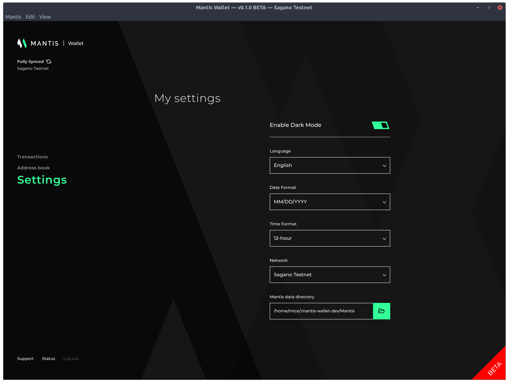
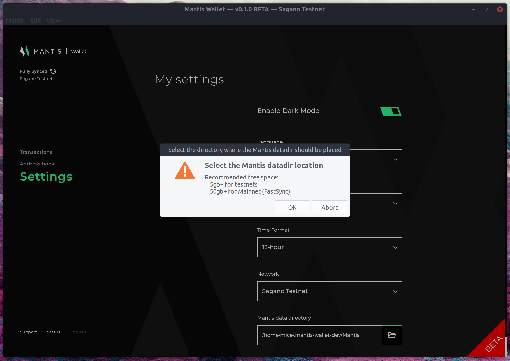

### Warning:
Mantis Wallet is a beta version and has not been security audited. We recommend you do not carry out transactions with significant ETC amounts when connected to Mainnet.

This initial Mantis Wallet release is a starting point from which we plan to build a best-in-class, multi-featured ETC Desktop Wallet. This full node wallet offers an intuitive and secure user experience.

# Our first release offers the ability to:

* Create an Ethereum Classic Wallet
* Easily connect to the Sagano & Mordor testnets as well as the Ethereum Classic mainnet using FastSync
* Send and receive ETC, and view balances
* View transaction details
* Use an address book to store contacts
* Easily submit tickets and extract logs for the IOHK Helpdesk
* Switch themes to suit user preference
* Advanced send transaction
* Restore your Mantis wallet using seed phrase or private key
* Password protected send transactions

## Known Issues

For the current list of issues that will be prioritised in the upcoming releases, see the [known issues page](../resources/known-issues).  

Please report any issues to our [Mantis Support Team](https://iohk.zendesk.com/hc/en-us/requests/new) or on the [Github Issues page](https://github.com/input-output-hk/mantis-wallet/issues).

## Planned improvements

* HD Wallet including complete account and transaction discovery
* Advanced fee information
* Auto-updates and improved user notifications
* Multi-Language
* Multi-Currency quotation of balance
* Light client
* Multi Token support, starting with ERC20s
* Hardware wallet support
* Separate address for different networks

## Password

For added security, the Mantis Wallet requires the user to enter their password when carrying out a Send transaction or when they wish to access their private-key, post wallet creation.

### Lost/Forgotten Password

If you have lost or forgotten your wallet password, you will need to remove the wallet manually from your machine, restore the wallet using your seed phrase or private key, and enter in a new password.

Your wallet directory is shown in Mantis Wallet local directory in the wallet’s status section.
The default Mantis Wallet storage directoties are:

* Linux: `/home/<user>/.mantis-wallet`
* macOS: `/User/<user>/.mantis-wallet`
* Windows: `C:\Users\<user>\.mantis-wallet`

## Changing the Wallet's Data Directory
You can change the location of the data files the wallet uses to store the distributed ledger and other working files.
When you select the settings button on the main page, you see a screen like this:  
  
Near the bottom of the screen, there is a text box and a browse button.
Mantis will examine the directory and initialize it if necessary.  
If Mantis has used it before, you will have the opportunity to control the actions Mantis will take:  

You can also change the directory using a custom configuration file or a DKey at startup. For details, read the [Mantis configuration instructions](/how-tos/how-to-configure-mantis). The necessary parameter is Mantis.walletDataDir.