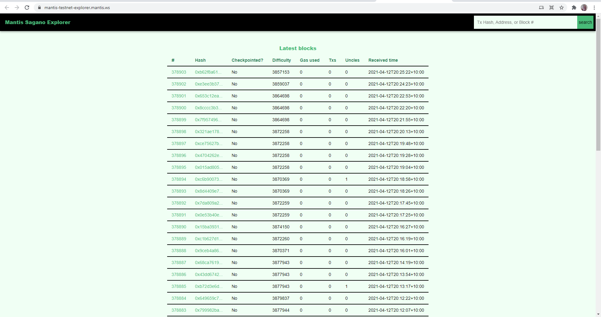

The Sagano testnet is a safe environment provided by the Mantis team to allow developers to  
 - Deploy and test their smart contracts
 - Test IOHK Ethereum Classic Improvment Proposals (ECIPs) when they are deployed  
 It also allows wallet users to interact with test ETC tokens obtained from a faucet.

To join Sagano with Mantis, use the `sagano` network definition:

```
./bin/mantis-launcher sagano
```
If you are using the wallet, you can also select the Sagano network from the splash screen on startup. After startup, you can change the network from the Settings menu.  

The Sagano Faucet and Explorer are vital tools needed to use the Sagano testnet correctly.

## Sagano Faucet

[Sagano Faucet](https://mantis-testnet-faucet-web.mantis.ws/) 
The Sagano Faucet supplies test ETC to make it easy for developers and users to run transactions in test mode.  
To obtain a coin, you provide your testnet address.   
You can claim a maximum of one coin every 24 hours.  
The test ETC has no value; no one can spend coins dispensed by the faucet on any network other than Sagano.  

## Sagano Explorer

[Sagano Explorer](https://mantis-testnet-explorer.mantis.ws/)  
This lightweight, browser-based explorer allows users to monitor activity on the testnet. The explorer shows detailed transaction activity as well as labeling which blocks are checkpointing blocks.  
To use it, click on the link above and save the address in your browser.


Future testnet releases look to support the evolution of  Ethereum Classic.
## Joining as a Miner

Pull Requests will be reviewed and accepted to join Sagano as a Miner.
