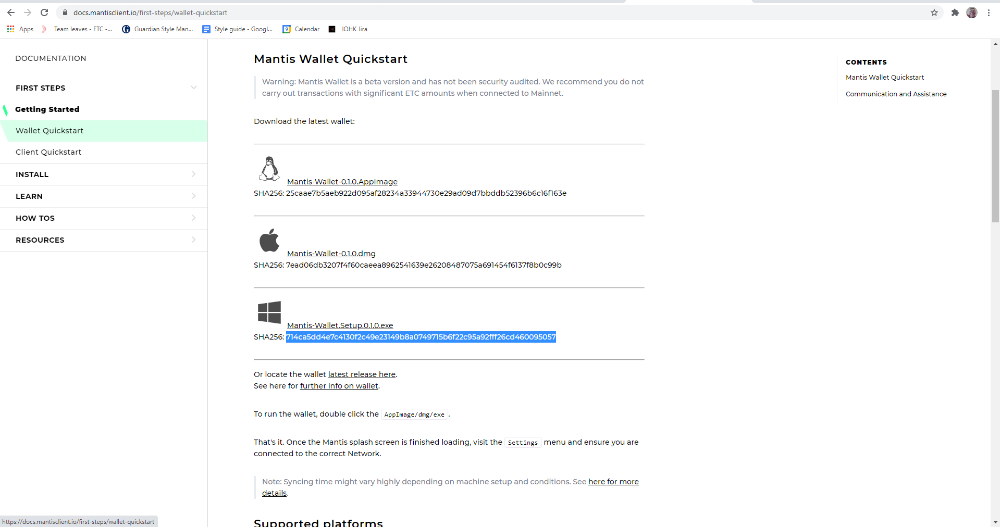
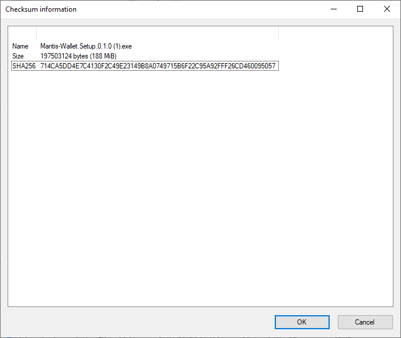

## Overview

This page shows how to make sure that the installer has not been corrupted during the download process. Microsoft Excel is a useful comparison tool.

## Get the hash from the website

The image shows the wallet page; the same principles apply to the client page.

The SHA-256 value is below the installer.
Open a blank spreadsheet and copy and paste the hash from the website to cell A1 of the spreadsheet.

## Get the hash from the downloaded file

On Windows 10, browse to the folder containing the downloaded file and use the alternate mouse button to display a context menu.

Select SHA-256 and copy the hash when Windows has finished calculating it. Paste the value into cell A2 of the spreadsheet.

## Compare the values

Copy or type this formula into cell A3:
`=IF(A1=A2,TRUE,FALSE)`
Press the tab key, and TRUE should appear in cell A3.

