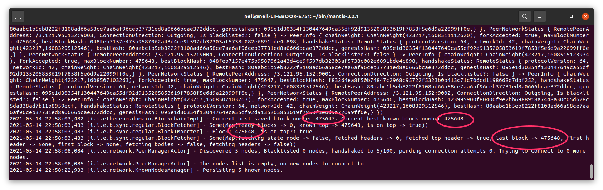
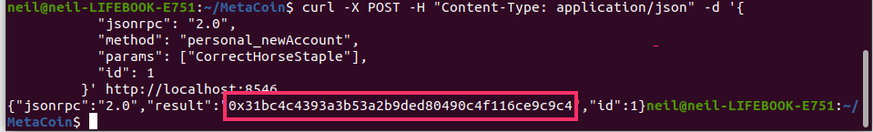

## Overview

Here we describe how to use the testing framework of the [truffle suite of products](https://www.trufflesuite.com/docs/truffle/testing/testing-your-contracts) to deploy smart contracts on the Sagano testnet.
## Installing Truffle
To use Truffle, install it according to the [supplier's instructions](https://trufflesuite.com/docs/truffle/getting-started/installation).
You can get some practice in setting up a Truffle test by following the [quick start guide](https://trufflesuite.com/docs/truffle/quickstart).
## Setting up a node

 To run your tests, you need a Mantis node synchronized with the Sagano test network. [Install the Mantis client](/first-steps/getting-started), go to the Mantis directory and run:
```
	./bin/mantis-launcher testnet-internal-nomad
```

When Mantis launches, it will begin the synchronizing process. That will take some time to complete. A fully synchronized node looks like this:  

## Obtaining a blockchain address
Open a terminal and issue these commands:

```   
	curl -X POST -H "Content-Type: application/json" -d '{
           "jsonrpc": "2.0",
           "method": "personal_newAccount",
           "params": ["<passphrase>"],
           "id": 1
         }' http://localhost:8546
```   
Put in your own string for a passphrase. The response will look like:   
	`	{"jsonrpc":"2.0","result":"0xe078b201e498c99aca8e725aad200d51e7a60e4c","id":1}`    
The result is your address string beginning with 0x.

## Funding your new address
The Sagano testnet provides test ETC using a faucet. 
Here is [the faucet web page](https://mantis-testnet-faucet-web.mantis.ws).
## Deploying your smart contracts
To deploy smart contracts to Sagano, you can follow [the Truffle instructions](https://www.trufflesuite.com/docs/truffle/quickstart).

Use the section "Alternative: Migrating with Ganache" but do not install Ganache, instead put the following in the "truffle-config.js" file:

	module.exports = {
		networks: {
			development: {
				host: "127.0.0.1",
				port: 8546,
				network_id: "*",
				from: "<your acquired address>"
			},
		}
	};   

Most of the above lines will already be present but commented out` in the default file generated by Truffle, but not the 'from:' line. 

## Additional note
When you follow the instructions on "trufflesuite" you may stumble upon an error about locked account. Before running (for example) "truffle migrate", unlock the account by running:

```	curl -X POST -H "Content-Type: application/json" \                                          
       -d '{
            "jsonrpc": "2.0",
            "method": "personal_unlockAccount",
            "params": ["<your address>", "your passphrase"],
            "id": 1
           }' http://localhost:8546
```

This process will unlock the account for some time.	
## Testing your contracts
After you issue the `truffle migrate` command, you can interact with your smart contract using the [Truffle console](https://www.trufflesuite.com/docs/truffle/getting-started/using-truffle-develop-and-the-console).

